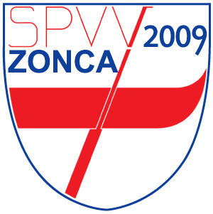

# Remiera Zonca - Gestionale Barche

<p align="center">
  
</p>

Gestionale web per la **Scuola Padovana di Voga alla Veneta "Vittorio Zonca"**.

Permette di gestire la flotta, i soci, le prenotazioni delle uscite in barca e la contabilità dalla remiera di Bastione dell'Arena a Padova.

## Funzionalità

### Gestione Soci
- **Anagrafica completa**: nome, ruolo voga (Pope, Paron, Provin, Ospite), tessera, contatti
- **Certificato medico**: scadenza, upload file (PDF/JPEG/PNG), download
- **Documenti aggiuntivi**: privacy, assicurazione, tessera UISP/FIC, altri documenti
- **Quota sociale**: storico multi-anno con importo, data pagamento, metodo, ricevuta
- **Promemoria automatici**: check settimanale, email 30 giorni prima della scadenza del certificato

### Gestione Flotta
- **Barche**: mascarete, sandoli, gondolini, caorline con posti e colore identificativo
- **Stato dettagliato**: attiva, in manutenzione (con motivo e data rientro previsto), fuori servizio
- Blocco automatico prenotazioni per barche non attive

### Prenotazioni & Presenze
- **Calendario settimanale** con 8 slot giornalieri
- **Prenotazioni** con selezione barca, pope (capitano), partecipanti
- **Conferma** da parte di Pope o Admin
- **Registro presenze**: tracciamento chi è effettivamente uscito vs solo prenotato
- **Statistiche** presenze per socio e per anno

### Comunicazioni
- **Notifiche email automatiche**: su creazione, conferma e cancellazione prenotazioni
- **Circolari ai soci**: admin invia comunicazioni a tutti o filtrate per ruolo
- **Form di contatto** pubblico con invio email
- **Impostazioni SMTP** configurabili da interfaccia admin

### Gestione Economica (solo Admin)
- **Registro entrate/uscite**: quote sociali, donazioni, manutenzione, materiali, affitto, eventi
- **Categorie**: quota_sociale, donazione, contributo, manutenzione, materiali, affitto, assicurazione, evento, altro
- **Report**: riepilogo per periodo con totali e scomposizione per categoria

### Dashboard & Meteo
- **Dashboard admin**: soci attivi per ruolo, certificati in scadenza, quote da incassare, barche per stato, prenotazioni del mese, bilancio annuale
- **Widget meteo Padova**: temperatura, vento, umidità, previsioni 3 giorni, alert automatico vento > 30 km/h

### Altro
- **Autenticazione JWT** con 3 livelli: Admin, Pope, Socio
- **Download modulo adesione** socio (PDF)

## Stack tecnologico

| Componente | Tecnologia |
|------------|------------|
| Frontend | React 18 + Vite |
| Backend | FastAPI (Python 3.11+) |
| Database | PostgreSQL 16 + PostGIS |
| ORM | SQLAlchemy 2 + Alembic |
| Auth | JWT (access + refresh token) |
| Email | SMTP OVH via aiosmtplib |
| Meteo | Open-Meteo API (gratuita, no key) |
| Deploy | Docker Compose + Portainer |

## Quick start

### 1. Clona e configura

```bash
git clone https://github.com/fgianoli/zonca.git
cd zonca
cp .env.example .env
# Edita .env con le tue credenziali
```

### 2. Avvia con Docker Compose

```bash
docker compose up -d --build
```

### 3. Migrazione database

```bash
docker exec -it zonca-api bash
alembic revision --autogenerate -m "init"
alembic upgrade head
```

### 4. Crea utente admin

```bash
docker exec -it zonca-api python -c "
from app.database import SessionLocal
from app.models.user import User
from app.services.auth import hash_password
db = SessionLocal()
admin = User(email='admin@scuolazonca.it', password_hash=hash_password('changeme'), role='admin')
db.add(admin)
db.commit()
print('Admin creato!')
"
```

### 5. Accedi

- **Frontend**: http://localhost
- **API docs (Swagger)**: http://localhost:8000/docs
- **Health check**: http://localhost:8000/api/health

## Sviluppo locale (senza Docker)

### Backend

```bash
cd backend
python -m venv .venv
source .venv/bin/activate  # Windows: .venv\Scripts\activate
pip install -r requirements.txt
uvicorn app.main:app --reload
```

### Frontend

```bash
cd frontend
npm install
npm run dev
```

Il dev server Vite su `:5173` fa proxy automatico di `/api` verso il backend su `:8000`.

## Struttura progetto

```
zonca/
├── docker-compose.yml
├── .env.example
├── logo_zonca.jpg
├── backend/
│   ├── app/
│   │   ├── main.py            # FastAPI app + scheduler
│   │   ├── config.py          # Settings
│   │   ├── database.py        # SQLAlchemy
│   │   ├── models/            # 10 modelli (vedi schema DB)
│   │   ├── schemas/           # Pydantic validation
│   │   ├── api/               # 13 router REST
│   │   │   ├── auth.py        # Login, register, refresh, me
│   │   │   ├── members.py     # CRUD + upload certificato
│   │   │   ├── boats.py       # CRUD + stato manutenzione
│   │   │   ├── bookings.py    # CRUD + conferma + notifiche
│   │   │   ├── attendance.py  # Registro presenze
│   │   │   ├── fees.py        # Storico quote sociali
│   │   │   ├── documents.py   # Documenti aggiuntivi
│   │   │   ├── finance.py     # Gestione economica
│   │   │   ├── circulars.py   # Comunicazioni ai soci
│   │   │   ├── dashboard.py   # Statistiche aggregate
│   │   │   ├── weather.py     # Meteo Padova
│   │   │   ├── settings.py    # Config SMTP
│   │   │   └── contact.py     # Form contatto
│   │   └── services/
│   │       ├── auth.py        # JWT + bcrypt
│   │       ├── email.py       # Invio SMTP
│   │       ├── notifications.py # Email prenotazioni
│   │       └── reminders.py   # Scheduler certificati
│   └── alembic/               # Migrazioni DB
└── frontend/
    ├── src/
    │   ├── components/        # ContactForm, DownloadAdesione
    │   ├── context/           # AuthContext (JWT)
    │   ├── api/               # Axios client
    │   └── styles/            # Theme veneziano
    └── nginx.conf             # Reverse proxy /api
```

## Schema database

10 tabelle:

| Tabella | Descrizione |
|---------|-------------|
| `users` | Autenticazione JWT, ruoli admin/pope/socio |
| `members` | Anagrafica soci, certificato medico, stato |
| `boats` | Flotta con tipo, posti, stato manutenzione |
| `bookings` | Prenotazioni con UNIQUE(date, slot, boat_id) |
| `booking_participants` | Relazione M:N booking-members |
| `attendances` | Registro presenze effettive |
| `fees` | Storico quote sociali per anno, UNIQUE(member_id, year) |
| `member_documents` | Documenti aggiuntivi (privacy, assicurazione, tessere) |
| `finance_records` | Registro entrate/uscite economiche |
| `circulars` | Archivio comunicazioni inviate ai soci |
| `app_settings` | Configurazioni runtime (SMTP, promemoria) |

## Ruoli e permessi

| Azione | Admin | Pope | Socio |
|--------|-------|------|-------|
| Gestire barche e soci | ✓ | | |
| Confermare prenotazioni | ✓ | ✓ | |
| Registrare presenze | ✓ | ✓ | |
| Creare prenotazioni | ✓ | ✓ | ✓ |
| Cancellare (solo proprie) | ✓ | ✓ | ✓ |
| Upload documenti | ✓ | proprio | proprio |
| Gestione economica | ✓ | | |
| Inviare circolari | ✓ | | |
| Configurare SMTP | ✓ | | |
| Vedere meteo | ✓ | ✓ | ✓ |

## API endpoints

### Auth
| Metodo | Endpoint | Descrizione |
|--------|----------|-------------|
| POST | `/api/auth/login` | Login, ritorna JWT |
| POST | `/api/auth/register` | Registra utente (admin) |
| POST | `/api/auth/refresh` | Refresh token |
| GET | `/api/auth/me` | Utente corrente |

### Soci & Documenti
| Metodo | Endpoint | Descrizione |
|--------|----------|-------------|
| GET/POST | `/api/members/` | Lista / crea soci |
| PATCH/DELETE | `/api/members/{id}` | Modifica / disattiva socio |
| POST | `/api/members/{id}/medical-cert` | Upload certificato medico |
| GET | `/api/members/{id}/medical-cert` | Download certificato medico |
| GET/POST | `/api/members/{id}/documents/` | Lista / upload documenti |
| GET | `/api/members/{id}/documents/{doc_id}/download` | Download documento |

### Flotta & Prenotazioni
| Metodo | Endpoint | Descrizione |
|--------|----------|-------------|
| GET/POST | `/api/boats/` | Lista / crea barche (filtro per stato) |
| GET/POST | `/api/bookings/` | Lista / crea prenotazioni |
| POST | `/api/bookings/{id}/confirm` | Conferma prenotazione |
| POST | `/api/attendance/bulk` | Registra presenze |
| GET | `/api/attendance/member/{id}/stats` | Statistiche presenze |

### Amministrazione
| Metodo | Endpoint | Descrizione |
|--------|----------|-------------|
| GET/POST | `/api/fees/` | Gestione quote sociali |
| GET | `/api/fees/summary?year=` | Riepilogo quote per anno |
| GET/POST | `/api/finance/` | Registro entrate/uscite |
| GET | `/api/finance/summary` | Riepilogo economico |
| GET/POST | `/api/circulars/` | Comunicazioni ai soci |
| GET | `/api/dashboard/stats` | Dashboard statistiche |
| GET/PATCH | `/api/settings/smtp` | Configurazione SMTP |

### Pubblici
| Metodo | Endpoint | Descrizione |
|--------|----------|-------------|
| POST | `/api/contact/` | Form contatto |
| GET | `/api/weather/current` | Meteo Padova + previsioni |
| GET | `/api/health` | Health check |

## Licenza

[Apache License 2.0](LICENSE)

## Contatti

**Scuola Padovana di Voga alla Veneta "Vittorio Zonca"**
Golena del Bastione dell'Arena - Corso Garibaldi, 41 - 35131 Padova
scuolazonca@gmail.com | tel. 347 084 1787
